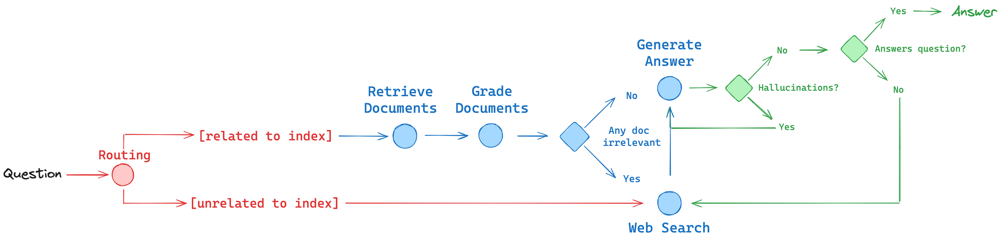

# LangGraph RAG (Local)

Создание (RAG)** агента с использованием **LangChain** и **LangGraph**, который работает в локальной среде. 
[Основан на примере из документации LangGraph](https://langchain-ai.github.io/langgraph/tutorials/rag/langgraph_adaptive_rag_local/)



### Основные особенности:
- Взаимодействие с языковой моделью для генерации ответов.
- Использование векторной БД для хранения информации о документах пользователя (вычисление эмбеддингов локально или с помощью NOMIC API).
- Использование адаптивного поиска для получения релевантных данных в интернете при отсутствии информации в БД.
- Локальная настройка для разработки и тестирования без облачных сервисов.
- Возможность настройки количества повторных попыток и управления процессом.

## Структура проекта

- `rag_venv/`: Папка с виртуальным окружением. Убедитесь, что вы активировали виртуальное окружение перед установкой зависимостей.
- `local_agent.ipynb`: Jupyter Notebook, содержащий код для локального запуска RAG агента с использованием LangGraph.
- `Remote LLM.ipynb`: Jupyter Notebook, демонстрирующий работу с удаленными языковыми моделями, расположенными на удаленном сревере. Использовать в Google Colab при нехватке локальной оперативной памяти.
- `requirements.txt`: Список зависимостей проекта. 
- `.gitignore`: Файл для исключения файлов и папок из контроля версий, таких как виртуальное окружение, кэш и чувствительные данные.
- `README.md`: Этот файл с инструкциями по установке и использованию проекта.

## Установка

Для начала работы с этим проектом выполните следующие шаги:

1. Клонируйте репозиторий:
   ```bash
   git clone https://github.com/stepan-zykov/RAG-with-local-LLM.git
   cd langgraph-adaptive-rag
   ```

2. Создайте виртуальное окружение и активируйте его:
   ```bash
   python -m venv rag_venv
   .\rag_venv\Scripts\activate  # для Windows
   source rag_venv/bin/activate  # для macOS/Linux
   ```

3. Установите зависимости:
   ```bash
   pip install -r requirements.txt
   ```

## Использование

### Запуск агента в Jupyter Notebook

1. Откройте и запустите Jupyter Notebook `local_agent.ipynb`:

   ```bash
   jupyter notebook local_agent.ipynb
   ```

2. В ноутбуке будет демонстрация работы агента, который получает ответ на вопрос, используя векторную БД, локальную модель и веб-поиск.

### Пример кода:

```python
inputs = {'question': "На каком конгрессе выступил ректор Горного университета?", "max_retries": 3}
for event in graph.stream(inputs, stream_mode='values'):
    print(event)
```

Этот код задает вопрос и передает его в агент, который затем генерирует ответ с использованием векторной БД, веб-поиска и локальной модели.

## Примечания

- Убедитесь, что у вас есть все требуемые ключи API (указаны в коде).
- Для работы с моделью через Google Colab и NGROK потребуется предварительно запустить Remote LLM на колаб.
- Проект использует **LangChain** и **LangGraph** для создания адаптивных RAG-агентов с возможностью интеграции с внешними источниками.

